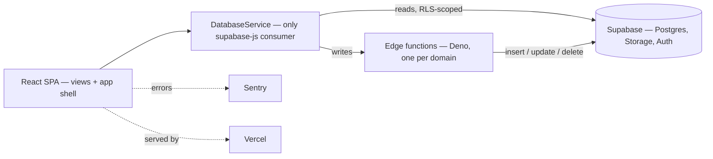

<p align="center">
  
</p>

<h1 align="center">Smyrna Tools</h1>

<p align="center">
  <b>The internal operations platform for Smyrna Ready Mix.</b>
</p>
<p align="center">
  Fleet, people, and plant performance in one place —<br />
  tracked across every region and plant at <a href="https://smyrnatools.com">smyrnatools.com</a>.
</p>

<p align="center">
  
  
  
  
  
  
  
  
</p>

<br />

## Why Smyrna Tools

Running a ready-mix operation means tracking hundreds of moving assets, an operator workforce flowing through onboarding, training, and duty changes, and plant efficiency numbers that only matter once they roll up across regions. Smyrna Tools puts all of it behind one authenticated portal: every mixer and manager has a verified record and a full change history, and every write goes through the server — the browser never mutates the database directly.

<table width="100%">
  <tr>
    <td width="33%" valign="top">
      <h3 align="center">Fleet &amp; assets</h3>
      <p align="center">Mixers, tractors, trailers, equipment, and pickup trucks — each with verification status, service tracking, and a full change-history timeline.</p>
    </td>
    <td width="33%" valign="top">
      <h3 align="center">People &amp; personnel</h3>
      <p align="center">The operator lifecycle from onboarding through training, active duty, light duty, and separation — plus manager profiles and role-based access.</p>
    </td>
    <td width="33%" valign="top">
      <h3 align="center">Productivity &amp; reporting</h3>
      <p align="center">Plant efficiency scoring, live dashboards, and weekly role-based reports across regions — with charts, maps, and Excel / PDF export.</p>
    </td>
  </tr>
</table>

<br />

## Stack

| Layer | Technology |
| :--- | :--- |
| UI | React 19 + React Router 7 |
| Build & dev | Vite 6 (output `build/`) |
| Styling | Tailwind CSS 3 — light / dark / gray themes via semantic tokens, no plain CSS |
| Backend | Supabase — Postgres, Auth, Storage, Deno edge functions |
| Charts & maps | Recharts · Leaflet |
| Icons | Font Awesome Free |
| Export | ExcelJS · jsPDF |
| Monitoring | Sentry · Vercel Analytics + Speed Insights |
| Testing | Vitest + Testing Library |
| Hosting | Vercel |

## Getting started

```bash
npm install
cp .env.example .env   # Supabase URL + keys, Sentry DSN, edge secrets
npm start              # Vite dev server on http://localhost:3000
npm run build          # production build to build/
```

| Variable | Purpose |
| :--- | :--- |
| `REACT_APP_SUPABASE_URL` | Supabase project URL. |
| `REACT_APP_SUPABASE_ANON_KEY` | Publishable key for the browser client. |
| `REACT_APP_EDGE_FUNCTIONS_URL` | Base URL the client posts writes to. |
| `REACT_APP_SUNDAY_MY_SUPABASE_URL` / `_ANON_KEY` | Sunday Files project, used for workbook uploads. |
| `REACT_APP_SENTRY_DSN` | Error reporting. |
| `REACT_APP_EMAIL_DEBUG` | Route outbound mail to the debug whitelist. |

`GROK_API_KEY`, `MAILERSEND_*`, `GOOGLE_MAPS_API_KEY`, `EDGE_INTERNAL_TOKEN`, and `EMAIL_DEBUG_WHITELIST` are read by the edge functions, not the React app — in production they are set with `supabase secrets set`.

### Scripts

| Script | Does |
| :--- | :--- |
| `npm start` | Vite dev server on port 3000. |
| `npm run build` | Production build to `build/`. |
| `npm run preview` | Serve the production build. |
| `npm test` | Run the Vitest suite once. |
| `npm run test:watch` | Vitest in watch mode. |
| `npm run lint` | ESLint over `src/`. |
| `npm run format` | Prettier over `src/`. |
| `npm run analyze` | Build with a Rollup bundle treemap. |

### Supabase workflow

A `supabase:*` script family wraps the Supabase CLI through `scripts/supabase.js`:

| Script | Does |
| :--- | :--- |
| `supabase:start` · `:stop` · `:status` | Run the local Supabase stack. |
| `supabase:db:reset` | Reset the local database. |
| `supabase:functions:serve` · `:deploy` · `:invoke` | Develop and ship edge functions. |
| `supabase:functions:list` · `:new` · `:download` · `:delete` | Manage edge functions. |
| `supabase:login` · `:init` · `:version` | CLI auth and setup. |

## Architecture



## How it works

- **One database gateway.** Every Supabase call flows through a single `DatabaseService.js` — the only module in the app that imports `@supabase/supabase-js`.
- **Writes live on the server.** The client reads through row-level security; every insert, update, and delete runs in a Deno edge function, one per domain (`mixer-service`, `operator-service`, `plant-service`, …).
- **JWT-scoped requests.** The database client swaps the publishable-key bearer for the current session JWT on every REST and realtime request, so PostgREST evaluates RLS against the signed-in user — and the token never touches storage.
- **Themed by tokens, never by hex.** All styling is Tailwind semantic tokens backed by CSS variables across three themes. The shared vocabulary lives in [`src/app/styles/DESIGN_SYSTEM.md`](src/app/styles/DESIGN_SYSTEM.md).

## Project structure

```
smyrnatools-com/
├── public/                 Logos, favicon, PWA manifest + service worker
├── docs/                   Operational reference data (workflow definitions)
├── scripts/                Dev/ops helpers — Supabase CLI wrapper, CalVer, email templates,
│                           dispatch-sync userscript
├── supabase/functions/     Deno edge functions (deployed individually) — all database writes
└── src/
    ├── index.jsx           Entry — Sentry init, context providers, root <App/>
    ├── app/                Shell — components, hooks, context, models, constants, ai, styles
    ├── views/              Feature domains — admin, assets, common, people, tools
    ├── services/           Service classes; DatabaseService.js is the only supabase-js consumer
    ├── utils/              Pure helpers (+ tests)
    ├── lib/                Internal libraries (sunday-analyzer)
    └── assets/             Images and video
```

## License

Copyright (c) 2026 Trenton Taylor. All rights reserved. See [LICENSE.md](LICENSE.md).

<br />

<p align="center">
  <sub>Built by <strong>Trenton Taylor</strong> for <strong>Smyrna Ready Mix</strong>.</sub>
</p>
